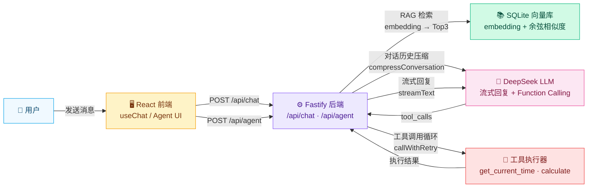

# AI Chat Full-Stack Demo

React + Fastify + DeepSeek 全栈 AI 聊天应用，支持 RAG 检索增强对话和 Agent 工具调用两种模式。

## Architecture



### Data Flow

**Chat 模式 (RAG)**：用户提问 → embedding 向量化 → SQLite 余弦检索 Top3 片段 → 注入 system prompt → DeepSeek 流式回复（附带来源引用）

**Agent 模式 (Tool Calling)**：用户请求 → LLM 判断是否需要工具 → 执行工具（时间/计算） → 结果追加到对话 → LLM 生成最终回答（最多 3 轮循环）

## Features

- **RAG 检索增强**：上传 .txt 文件，自动切片 + embedding 存入向量库，对话时检索相关片段
- **Agent 工具调用**：OpenAI Function Calling 标准，支持获取当前时间、数学计算
- **对话历史压缩**：超过 4000 token 自动总结早期轮次，保留最近 4 条消息
- **LLM 调用重试**：指数退避 + 随机抖动，自动重试 429/5xx 错误，4xx 直接失败
- **流式回复**：Vercel AI SDK streamText，逐字显示 + 来源标注
- **双模式切换**：Chat (RAG) 和 Agent (Tool Calling) 一键切换

## Quick Start

### Docker（推荐）

```bash
# 1. 配置环境变量
cp .env.example .env
# 编辑 .env，填入你的 DeepSeek API Key

# 2. 启动
docker compose up --build

# 3. 访问
# 前端: http://localhost:5173
# 后端健康检查: http://localhost:3001/api/health
```

### 本地开发

```bash
# 1. 配置环境变量
cp .env.example .env
# 编辑 .env，填入你的 DeepSeek API Key

# 2. 启动后端（终端 1）
cd backend
npm install
npm run dev

# 3. 启动前端（终端 2）
cd frontend
npm install
npm run dev

# 4. 访问 http://localhost:5173
```

## Project Structure

```
.
├── backend/
│   ├── src/
│   │   ├── server.js          # Fastify 服务 + API 路由
│   │   ├── agent.js           # Agent 工具定义 + 循环执行
│   │   ├── llm-utils.js       # callWithRetry + compressConversation
│   │   ├── db.js              # SQLite 向量数据库
│   │   └── embeddings.js      # Ollama embedding 接口
│   ├── test-llm-utils.mjs     # 单元测试（mock）
│   ├── test-integration.mjs   # 集成测试（真实 API）
│   ├── Dockerfile
│   └── package.json
├── frontend/
│   ├── src/
│   │   ├── App.jsx            # 聊天 UI + useChat hook
│   │   ├── SourceCard.jsx     # 来源引用卡片组件
│   │   ├── App.css
│   │   └── main.jsx
│   ├── vite.config.js
│   ├── Dockerfile
│   └── package.json
├── docker-compose.yml
├── .env.example
└── README.md
```

## API Endpoints

| Method | Path | Description |
|--------|------|-------------|
| POST | `/api/chat` | RAG 增强的流式对话 |
| POST | `/api/agent` | Agent 工具调用模式 |
| POST | `/api/upload` | 上传 .txt 文件到向量库 |
| GET | `/api/health` | 健康检查（返回当前模型名） |

## Tech Stack

| Layer | Tech |
|-------|------|
| Frontend | React 19, Vite, @ai-sdk/react, useChat |
| Backend | Fastify 5, @ai-sdk/openai, Vercel AI SDK |
| AI | DeepSeek API (OpenAI-compatible) |
| Vector DB | SQLite + sql.js (余弦相似度搜索) |
| Embedding | Ollama (本地向量化) |
| Text Splitting | LangChain RecursiveCharacterTextSplitter |
| Resilience | callWithRetry (指数退避), compressConversation (历史压缩) |
| Infra | Docker Compose |

## Environment Variables

| Variable | Default | Description |
|----------|---------|-------------|
| `DEEPSEEK_API_KEY` | (required) | DeepSeek API 密钥 |
| `DEEPSEEK_BASE_URL` | `https://api.deepseek.com/v1` | API 端点地址 |
| `DEEPSEEK_MODEL` | `deepseek-chat` | 模型名称 |
| `PORT` | `3001` | 后端服务端口 |

## Testing

```bash
cd backend

# 单元测试（mock，毫秒级，无需 API Key）
node test-llm-utils.mjs

# 集成测试（真实 API，需要 .env 配置）
node test-integration.mjs
```

## Version History

| Version | Changes |
|---------|---------|
| v1 | React + Fastify 基础聊天，DeepSeek 流式回复 |
| v2 | RAG 管道：文件上传 → 切片 → embedding → 向量检索 → 来源引用 |
| v3 | Agent 模式：OpenAI Function Calling 标准，工具执行循环 |
| v4 | LLM 健壮性：callWithRetry 指数退避重试 + compressConversation 对话压缩 |
